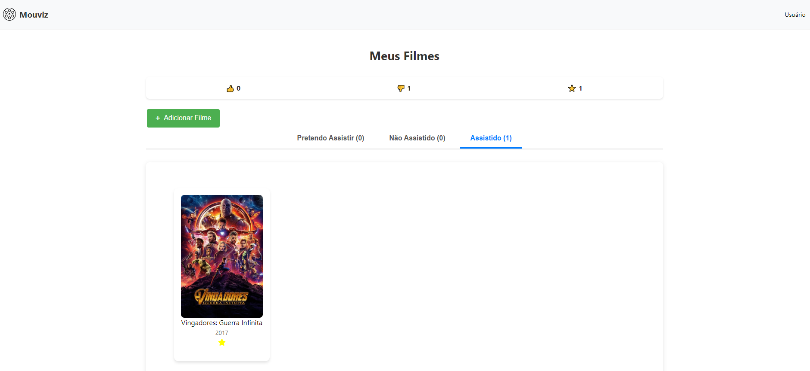

# Mouvi

## Descrição do Projeto

A aplicação web Mouvi permite ao usuário pesquisar títulos de filmes utilizando uma API de filmes, como a API do "The Movie DB" ([documentação da API](https://developer.themoviedb.org/docs/getting-started)).

Além disso, o usuário pode marcar seus filmes em listas de categorias como: "Não Assistindo", "Pretende Assistir", "Assistido", assim como dar notas, favoritar e dar likes para seus filmes.


[](https://streamable.com/e/5hk8tu)

## Como Executar

Antes de começarmos, certifique-se de ter o Docker e o Docker Compose instalados em sua máquina. Caso não esteja instalado, você pode seguir as instruções de instalação no site oficial do Docker: https://docs.docker.com/get-docker/

1. Clone o repositório:
```bash
   git clone https://github.com/seu-usuario/seu-repositorio.git
```	

 2. Navegue até o diretório e procure o arquivo .env e adicione sua chave de API do The Movie DB:

  Instruções para obter uma chave de API da API do The Movie DB: https://developer.themoviedb.org/reference/intro/authentication


```bash
      cd mouvi/backend
      API_KEY="sua-api-key"
```

  3. Suba a aplicação com Docker Compose: Certifique-se de que o arquivo docker-compose.yml esteja configurado corretamente. Então, execute:

```bash
docker-compose up -d
```

  4. Acesse a aplicação: Após o Docker Compose terminar de construir e iniciar os containers, você pode acessar a aplicação em http://localhost:3000 (ou a porta configurada).

  Parar a aplicação: Para parar os containers e liberar os recursos, execute:

```bash
docker-compose down
```

## Endpoints da API

Caso queira testar os endpoints da API, pode utilizar o Insomnia ou Postman. Você também pode usar o arquivo chamado .http junto com a extensão do VSCode chamada [Rest Client](https://marketplace.visualstudio.com/items?itemName=humao.rest-client)

## Contribuições
Sinta-se à vontade para contribuir com o projeto! Envie pull requests, abra issues ou entre em contato para discutir melhorias.

## Licença
Este projeto está licenciado sob a Licença MIT.